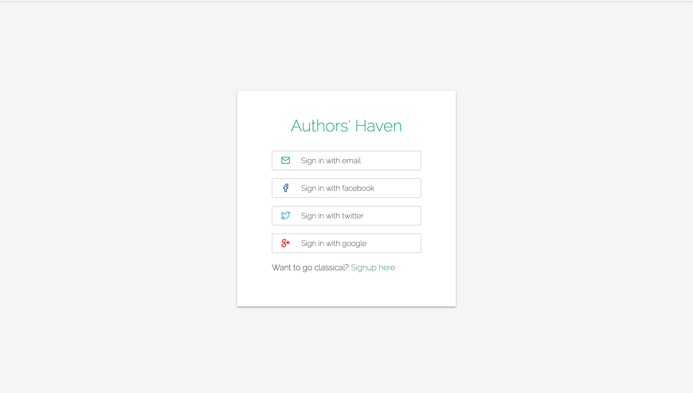
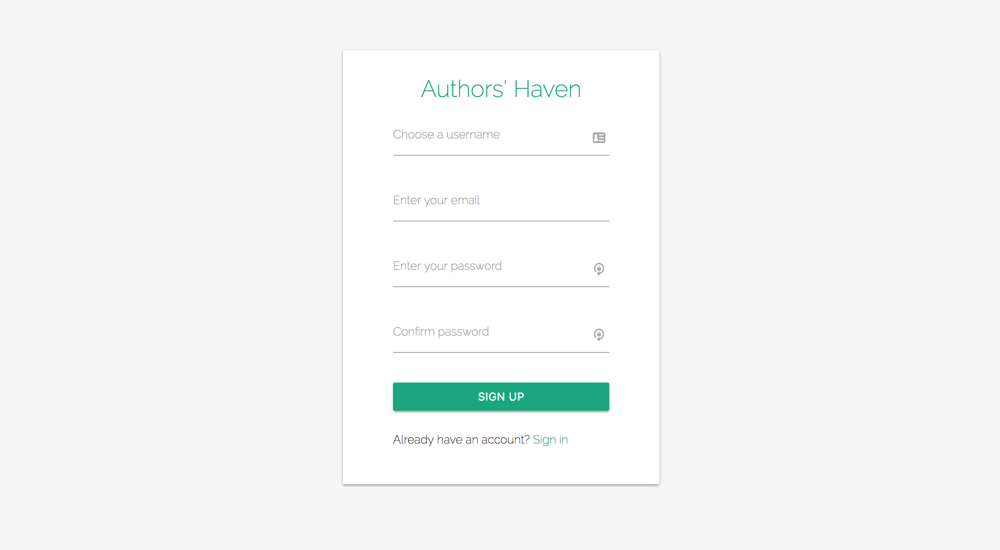
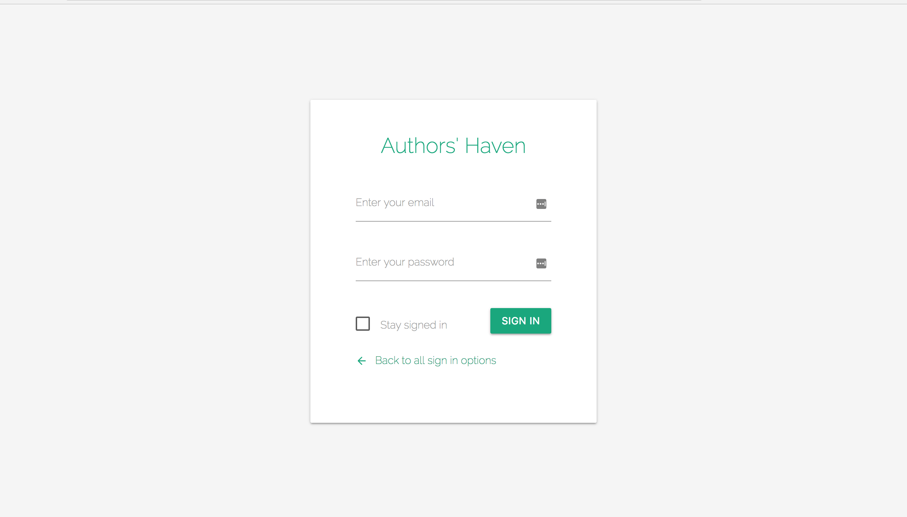

# Mockup Displays

## Getting Started

These instructions will get you to set up sass and live server so that you view the css mockups locally.

### Prerequisites

- Sass
- Live-server

### Installation

1.  Install sass

```
brew install sass/sass/sass
```

2.  Install live-server

```
npm -i -g live-server
```

### Quick Start

1.  Navigate to ah-jarvis and run the following command sass for compilation of sass to css

```
$ sass --watch ui/sass/main.scss ui/static/styles.css
```

2.  Run live server from a different terminal

```
$ live-server .
```

### Social Login



## Sign Up page



## Sign In Page


